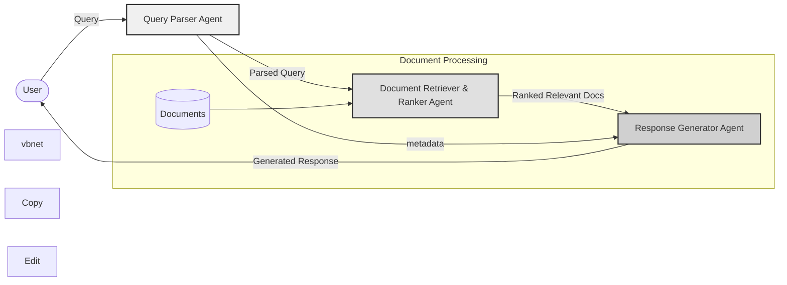

# Multi-Agent RAG system

This project implements a **Multi-Agent Retrieval-Augmented Generation (RAG)** system, leveraging machine learning models to retrieve relevant information from a database and use it to generate contextual responses. The system is designed for solving complex tasks by distributing workloads across multiple agents, each responsible for a specific aspect of the task.



## AGENTS:
- Agent 1: Query Parser: Analyzes user queries to extract key terms or topics.
- Agent 2: Document Retriever: Searches the document database for relevant files.
- Agent 3: Document Ranker: Ranks the retrieved documents by relevance.
- Agent 4: Response Generator: Synthesizes a concise answer from the top-ranked documents.

## Setup

1. Install the required dependencies:
    ```sh
    pip install -r requirements.txt
    ```

2. Create a `.env` file in the root directory and add your Groq API key:
    ```env
    GROQ_API_KEY=your_api_key_here
    ```

## Usage

To run the Streamlit app, use the following command:
```sh
streamlit run app.py
```


## Project Structure

```
multi_agent_rag/
│
├── agents/
│   ├── document_retriever_ranker.py
│   ├── query_parser.py
│   ├── response_generator.py
│   └── utils.py
│
├── documents/
│   └── (your text documents here)
│
├── app.py
├── .env
├── requirements.txt
└── README.md
```
